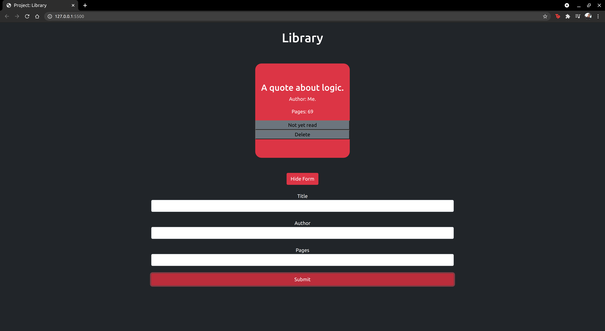

# Library

[Click here to view live demo](https://ryelbanfield.github.io/library/)

A small library app.

Users can create `books` and mark those `books` as either `Finished reading` or `Not yet read`. Users can also `delete` the `books` if they like.

Additional description about the project and its features.

## Built With

- JavaScript
- Bootstrap

## Getting Started

- Download or clone this repo by using `git clone https://github.com/RyelBanfield/library.git`
- Enter the project folder and run locally by using a VS Code extension such as `Live Server`.

## Author

👤 **Ryel Banfield**

- GitHub: [@RyelBanfield](https://github.com/ryelbanfield)
- Twitter: [@RyelBanfield](https://twitter.com/ryelbanfield)
- LinkedIn: [Ryel Banfield](https://www.linkedin.com/in/ryel-banfield/)

## 🤝 Contributing

Contributions, issues, and feature requests are welcome!

Feel free to check the [issues page](../../issues/).

## Show your support

Give a ⭐️ if you like this project!

## Acknowledgments

- Hat tip to anyone whose code was used
- Inspiration
- etc

## 📝 License

This project is [MIT](LICENSE) licensed.
